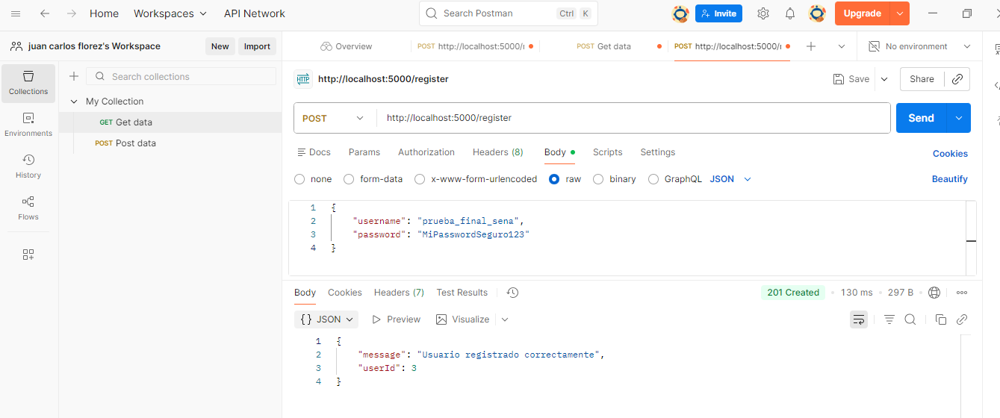
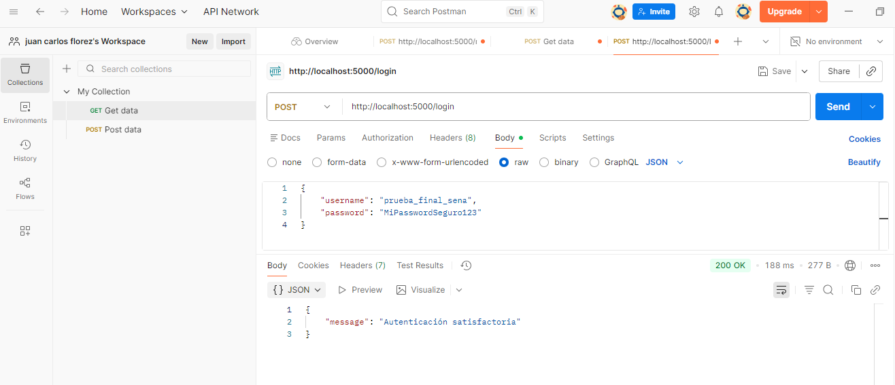

# Documento de Pruebas de la API de Autenticación
**Evidencia:** GA7-220501096-AA5-EV02
**Aprendiz:** Juan Carlos Flórez
**Fecha:** 17 de Noviembre de 2025

## 1. Información General de la API

| Elemento | Detalle |
| :--- | :--- |
| **Tecnología** | Node.js (Express), SQLite |
| **URL Base** | http://localhost:5000 |
| **Repositorio** | [https://github.com/jkflorez95-sena/ServicioWeb] |

## 2. Pruebas de Endpoints con Postman

Se realizaron pruebas de los endpoints de la API (/register y /login) para verificar la correcta implementación de los mensajes requeridos: **"Autenticación satisfactoria"** y **"Error de autenticación"**.

### Prueba 1: Registro de Nuevo Usuario (POST /register)

**Objetivo:** Verificar la creación exitosa del recurso (Status 201).

| Detalle | Especificación |
| :--- | :--- |
| **Petición** | POST http://localhost:5000/register |
| **Body (JSON)** | {"username": "usuario_prueba", "password": "password123"} |
| **Respuesta Esperada** | 201 Created |
| **Resultado Confirmado** | {"message": "Usuario registrado correctamente", "userId": [número]} |

**PANTALLAZO 1: Registro de Nuevo Usuario**

### Prueba 2: Login Exitoso (Autenticación Satisfactoria)

**Objetivo:** Verificar el requisito de éxito de la evidencia (código 200).

| Detalle | Especificación |
| :--- | :--- |
| **Petición** | POST http://localhost:5000/login |
| **Body (JSON)** | {"username": "usuario_prueba", "password": "password123"} |
| **Respuesta Esperada** | 200 OK |
| **Resultado Clave** | **{"message": "Autenticación satisfactoria"}** |

**PANTALLAZO 2: Login Exitoso**

---

### Prueba 3: Login Fallido (Error de Autenticación)

**Objetivo:** Verificar el requisito de fallo de la evidencia (código 401).

| Detalle | Especificación |
| :--- | :--- |
| **Petición** | POST http://localhost:5000/login |
| **Body (JSON)** | {"username": "usuario_prueba", "password": "pass_incorrecta"} |
| **Respuesta Esperada** | 401 Unauthorized |
| **Resultado Clave** | **{"error": "Error de autenticación"}** |

**PANTALLAZO 3: Login Fallido**
)